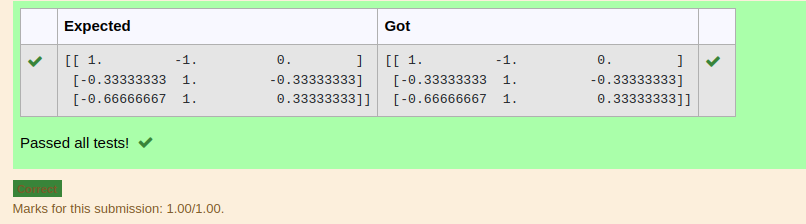

# INVERSE-OF-A-MATRIX
## Aim:
To write a python program to find the inverse of a matrix
## Equipment’s required:
1. 	Hardware – PCs
2. 	Anaconda – Python 3.7 Installation / Moodle-Code Runner
## Algorithm:
### Step1 : 
import numpy as np
### Step 2:
get an input from the user
### Step 3:
apply in the formula
### Step 4:
print the output

## Program:
``` python
#Program to find the inverse of a matrix.
#Developed by: Siva Chandran R 
#RegisterNumber:22005531
import numpy as np
a=np.array([[2,1,1],[1,1,1],[1,-1,2]])
b=np.linalg.inv(a)
print(b)
```


## Output:


## Result:
Thus the inverse of given matrix is successfully solved using python program.

